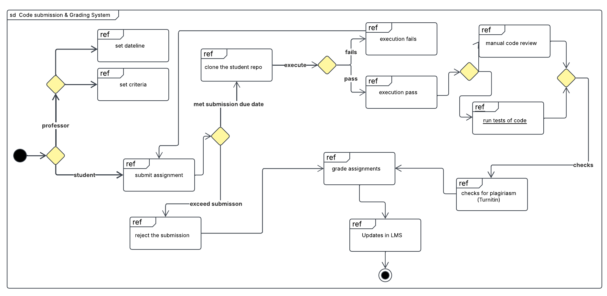

# Practical 1 

## Automated Assignment Submission Portal

###  Introduction
This report presents the Interaction Overview Diagram (IoD) and Use Case Diagram (UCD) for an Automated Assignment Submission Portal designed to streamline the grading process for SWE courses. The system aims to automate assignment grading, integrate plagiarism detection, and enhance auditing and LMS integration.

### System Overview
Currently, there is no plagiarism checker or automated marking software for grading programming assignments. Professors manually review assignments by cloning student repositories, running the code, and inspecting results in VS Code. The new system will automate these processes while ensuring compliance with university regulations and auditing requirements.

### 1. Interaction Overview Diagram

#### Workflow Steps
1. **Student Intends to Submit:** The student decides to submit the assignment.

2. **Submission Decision:** The student chooses whether to submit the assignment or not.
- If the student does not submit, no grading occurs, leading back to the intention to submit.

3. **Assignment Submission:** The student submits the assignment, which is pushed to GitHub.

4. **Submission Verification:** The student reviews the submission and decides whether to:
- **Resubmit:** If changes are needed, the student updates the assignment and resubmits it to GitHub.
- **Finalize Submission:** If satisfied, the student confirms the final submission.

5. **Professor Reviews Submission:** The professor clones the repository from GitHub to their local machine.

6. **Code Execution:** 
- The professor manually runs the code.
- If execution fails, the student must resubmit the corrected assignment.

7. **Code Review & Grading:** 
- If execution is successful, the professor performs a manual code review based on grading criteria.
- The final grade is assigned to the student.

### 2. Use Case Diagram 

### 3. Interaction Overview Diagram

