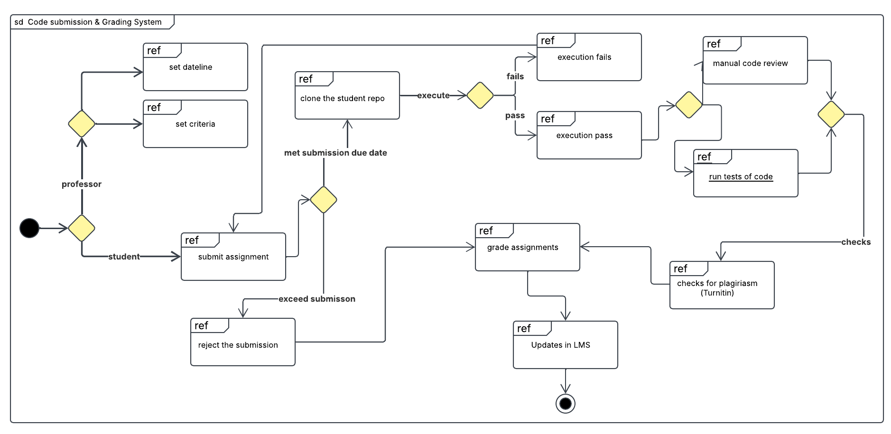

# Practical 1 

## Automated Assignment Submission Portal

###  Introduction
This report presents the Interaction Overview Diagram (IoD) and Use Case Diagram (UCD) for an Automated Assignment Submission Portal designed to streamline the grading process for SWE courses. The system aims to automate assignment grading, integrate plagiarism detection, and enhance auditing and LMS integration.

### System Overview
Currently, there is no plagiarism checker or automated marking software for grading programming assignments. Professors manually review assignments by cloning student repositories, running the code, and inspecting results in VS Code. The new system will automate these processes while ensuring compliance with university regulations and auditing requirements.

### 1. Interaction Overview Diagram

#### Workflow Steps
1. **Student Intends to Submit:** The student decides to submit the assignment.

2. **Submission Decision:** The student chooses whether to submit the assignment or not.
- If the student does not submit, no grading occurs, leading back to the intention to submit.

3. **Assignment Submission:** The student submits the assignment, which is pushed to GitHub.

4. **Submission Verification:** The student reviews the submission and decides whether to:
- **Resubmit:** If changes are needed, the student updates the assignment and resubmits it to GitHub.
- **Finalize Submission:** If satisfied, the student confirms the final submission.

5. **Professor Reviews Submission:** The professor clones the repository from GitHub to their local machine.

6. **Code Execution:** 
- The professor manually runs the code.
- If execution fails, the student must resubmit the corrected assignment.

7. **Code Review & Grading:** 
- If execution is successful, the professor performs a manual code review based on grading criteria.
- The final grade is assigned to the student.

### 2. Use Case Diagram 

#### Actors
1. Professor
2. Student
3. System
4. Regulatory body 
5. Turninin

#### Workflow  
1. Student Submits Assignment
- A student logs in and submits their assignment to the system.
- The system validates the submission and checks if it is before the deadline.
- If the deadline has passed, the submission is rejected.

2. Resubmission of Assignment
- If the submission is not final, the student may resubmit the assignment multiple times before the deadline.

3. Code Execution
- Once the submission is finalized, the system runs the code.
- If the code fails to execute, the student is notified and must resubmit the corrected code.

4. Plagiarism Check
- The system integrates with Turnitin to check for plagiarism.
- If plagiarism is detected, the professor is notified for further review.

5. Grading Process
- The professor clones the repository and manually reviews the assignment.
- The professor assigns a grade based on predefined grading criteria.
- The grades and feedback are stored in the system.

6. Viewing Grades and Feedback
- The student can view their grade and feedback after grading is complete.

7. LMS Integration & Auditing
- The system stores the grades and synchronizes them with the LMS.
- The regulatory body audits the grades annually for complian

### 3. Interaction Overview Diagram

The diagram combines elements from Use Case Diagram (UCD) and Interaction Overview Diagram (IoD) to provide a high-level view of the system’s functionality.

#### Key Components:
- **Actors:** Student, Professor.
- **System Actions:** Uploading assignments, running code, checking plagiarism, and grading.
- **External Systems:** GitHub, LMS, and Turnitin.
- **Workflow:** Shows how students submit assignments, how the system processes them, and how professors review and grade submissions.

This combined diagram provides a clear visual representation of interactions between users, the system, and external tools, ensuring a structured grading process. 

### Conclusion
This practical explored the Use Case Diagram (UCD) and Interaction Overview Diagram (IoD) for an automated grading system. By analyzing the interactions between students, professors, and external systems (GitHub, LMS, Turnitin), we designed a structured workflow for assignment submission, plagiarism detection, and grading. The diagrams provide a clear visualization of the system’s functionality, ensuring an efficient and automated grading process