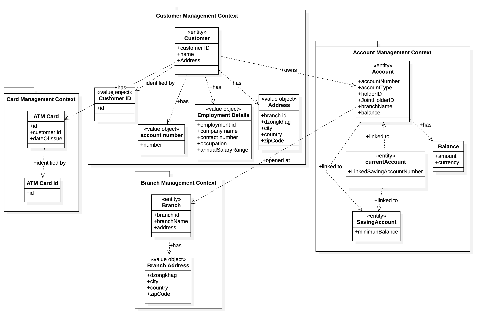

# Domain-Driven Design

### DOMAIN OBJECTS
#### Bounded Contexts
1. Customer Management
2. Account Management
3. Branch Management
4. ATM Card Management

### Entities and Aggregates

| Entity         | Attributes |
|----------------|-----------------------------------------|
| **Customer**   | customerID, name, address (Address), employmentDetails (EmploymentDetails) |
| **Account**    | accountNumber, accountType, holderID, jointHolderID, branchName, balance (Balance) |
| **SavingAccount** | minimumBalance |
| **CurrentAccount** | linkedSavingAccountNumber |
| **Branch**     | branchID, branchName, address (BranchAddress) |
| **ATMCard**    | id, customerID, dateOfIssue |

#### Customer (Aggregate Root in Customer Management)
- CustomerID
- Name
- Address
- EmploymentDetails (Value Object)
- Accounts (List of account numbers)

#### Account (Aggregate Root in Account Management)
- AccountNumber
- AccountType (Enum: Saving / Current)
- HolderID (CustomerID)
- JointHolderID (nullable CustomerID)
- BranchName
- Balance

**SavingAccount and CurrentAccount can be modeled using inheritance or AccountType polymorphism.**

#### SavingAccount (extends Account)
- MinimumBalance

#### CurrentAccount (extends Account)
- LinkedSavingAccountNumber (nullable)

#### ATMCard (Entity in ATM Card Management)
- ATMCardID
- CustomerID
- DateOfIssue

#### Branch (Entity in Branch Management)
- BranchName
- Address

### Value Objects
| Value Object         | Attributes |
|-----------------------|-------------------------------------------|
| **CustomerID**        | id |
| **AccountNumber**     | number |
| **EmploymentDetails** | employmentID, companyName, contactNumber, occupation, annualSalaryRange |
| **Address**           | street, city, state, zipCode |
| **BranchAddress**     | street, city, dzongkhag |
| **ATMCardID**         | id |
| **Balance**           | amount, currency |

#### Descriptions 
- A **Customer** can have multiple **Accounts** (either single or joint).  
- A **Branch** has no reference to its accounts but every **Account** belongs to a **Branch**.  
- **ATMCard** is independent of **Account** lifecycle (can be issued or terminated independently).  

### Relationships
#### Customer Management Context
#####  Customer
- has one Address (as a value object).
- has one EmploymentDetails (as a value object).
- identified by one CustomerID (value object).
- has multiple AccountNumbers (as value objects, to represent their accounts).
- can have zero or one ATMCard (optional, since a customer may or may not have an ATM card).
- owns one or more Accounts (single or joint ownership of multiple accounts).

#### Account Management Context
#### Account
- has one Balance (value object).
- belongs to one Branch (a single branch where the account is held).
- may have one jointHolderID if it’s a joint account.

#### CurrentAccount
- inherits from Account.
- linked to one SavingAccount (indicates overdraft or savings link).

#### SavingAccount
- inherits from Account.

#### Branch Management Context
##### Branch
- has one BranchAddress (value object describing the branch’s physical location).
- does not directly reference Accounts, but accounts point back to the branch they belong to.

#### Card Management Context
##### ATMCard
- identified by one ATMCardID (value object).
- associated with one Customer (customerID field).
- independent of the account lifecycle; a customer can terminate or get a new ATM card at any time.

